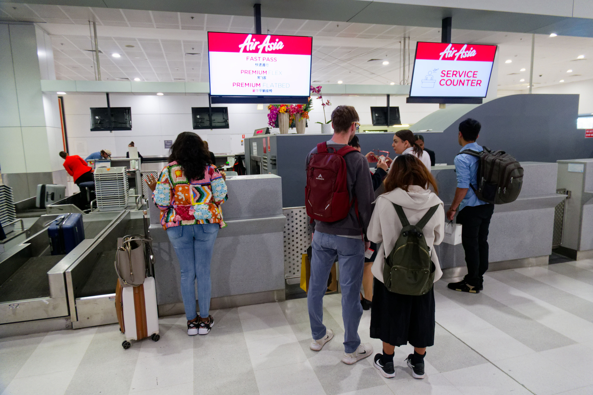
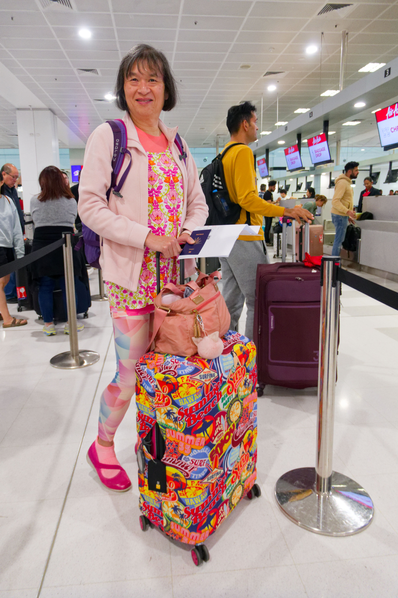
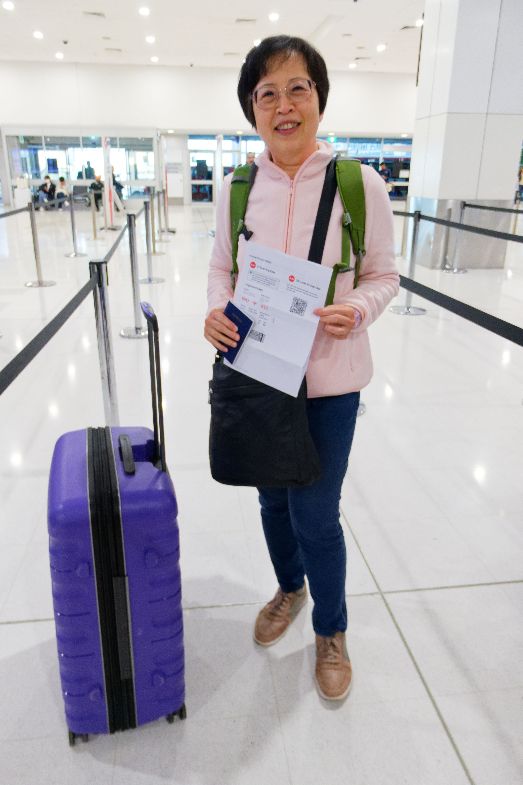
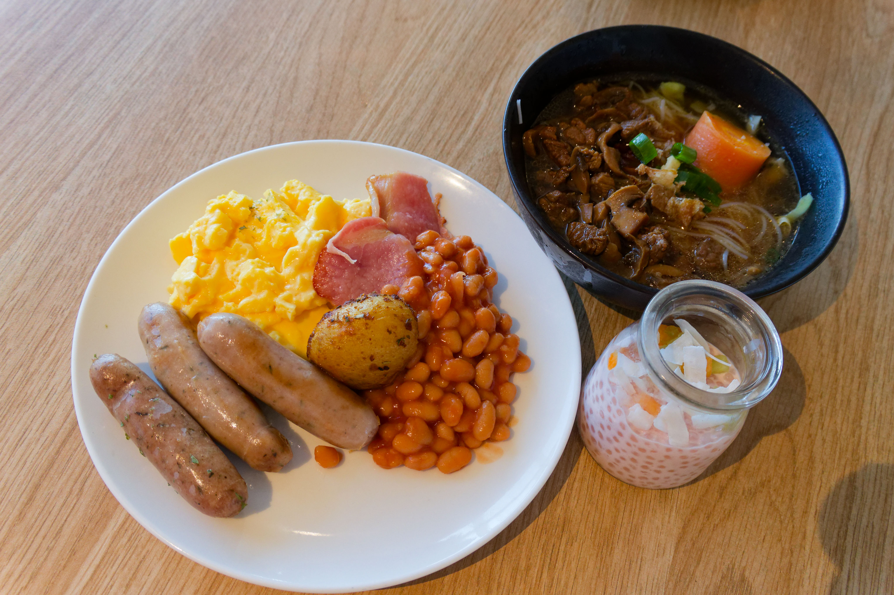
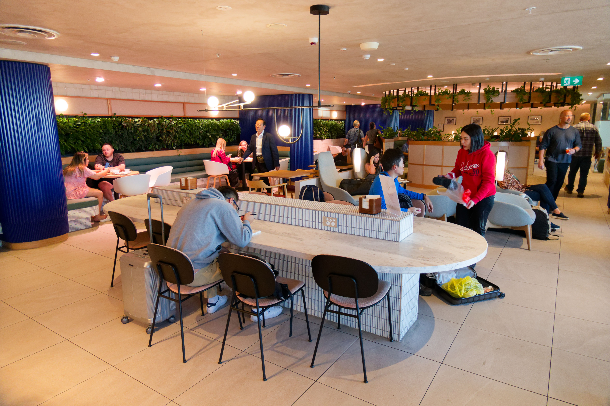
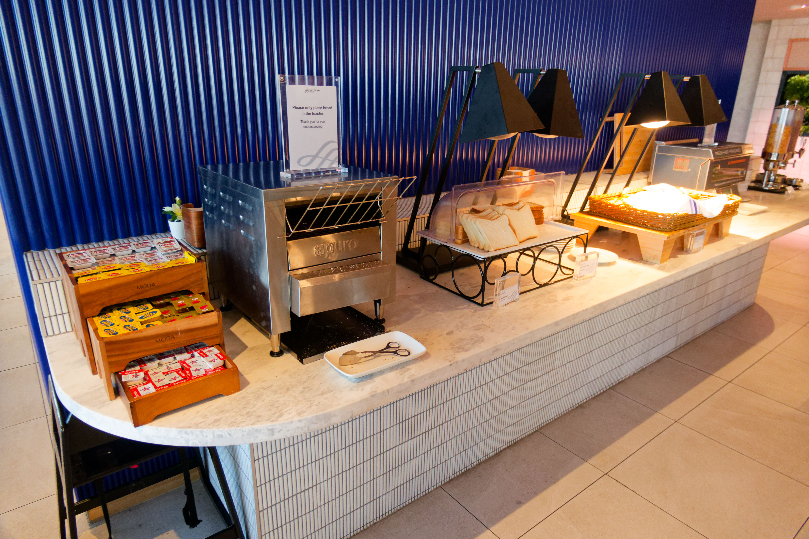
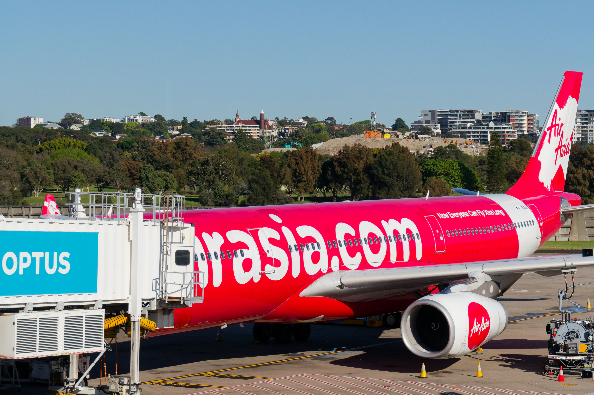
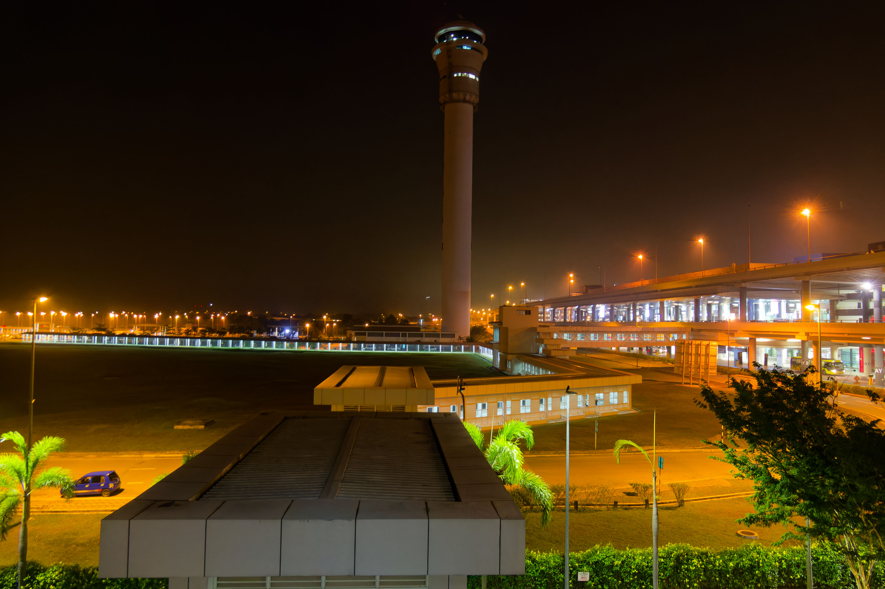
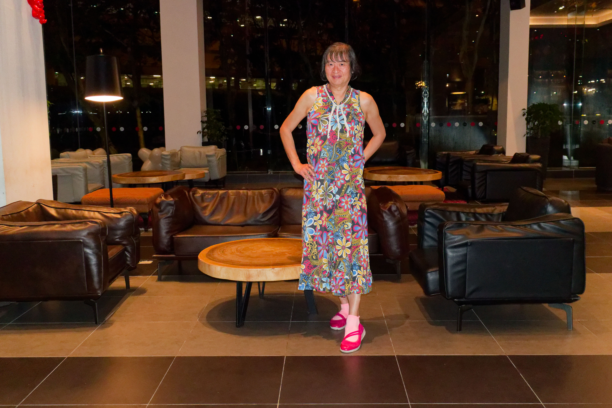
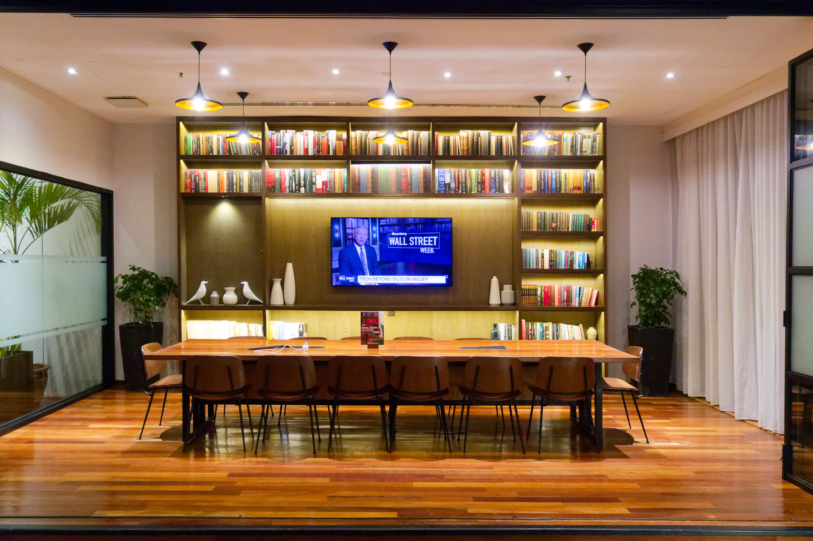

## Sydney Airport

We started our trip by checking in at the AirAsia counter at Sydney Airport. I was really surprised that we were given express passes through airport immigration as well as access to the lounge.

## Sky Lounge

We had a good breakfast at the lounge. I had sausages, bacon, eggs, baked beans and potatoes and the lounge was quite pleasant.

After breakfast we boarded the plane and had an uneventful flight to Kuala Lumpur. I enjoyed the premium flatbed, although I sat upright the whole flight as I was working on translating a Pali textbook at the time on the laptop.

## Tune Hotel

We arrived at KLIA2 around 5pm in the afternoon, and had a quick dinner at the airport before heading off to Tune Hotel to stay for the night. We had problems finding the way to the hotel, and eventually a security guard pointed out the way. There is a covered walkway to the hotel and it was very close to the airport.

From the hotel we can see the control tower for KLIA2.

The hotel itself was quite nice. The lobby was pleasant enough:

There was a nicely decorated library next to the lobby which I thought was a nice touch:

Time to go to sleep, because there is an early flight to Johor Bahru tomorrow!
